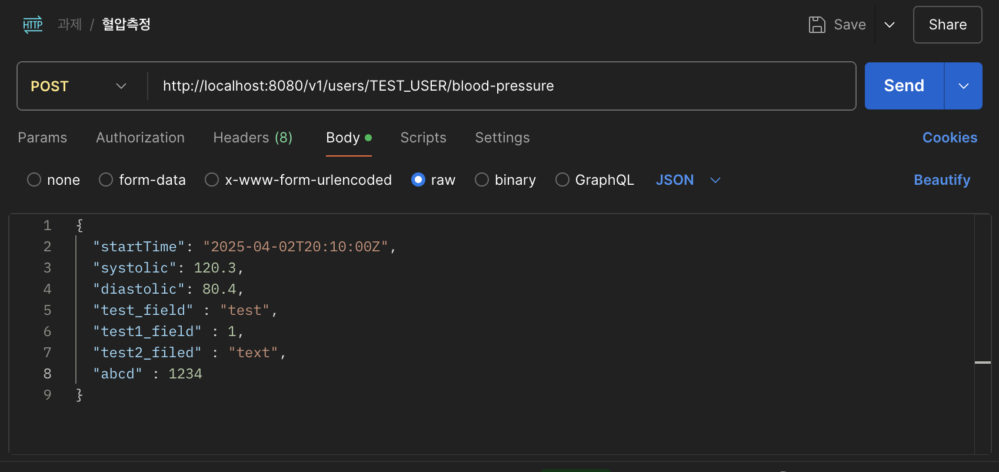

# 프로젝트 개요 및 아키텍처

## 프로젝트 목적
- 여러 서비스(마이크로서비스)들이 하나의 Lifelog 플랫폼을 이용하여 유저의 혈압, 걸음 수, 체중 등 다양한 건강 데이터를 관리하는 시스템 구현
- 개인정보 보호를 위해 데이터 암호화 처리 및 조회 시 복호화 기능 포함

## 주요 구성 요소
- **Eureka Server**:
    - 서비스 레지스트리 역할을 수행하여, 각 마이크로서비스의 등록 및 검색 기능 제공

- **API Gateway**:
    - 외부 클라이언트의 요청을 각 서비스로 라우팅
    - 통합 Swagger 문서를 제공하여 API 명세 관리

- **User Service**:
    - 사용자 관련 API 제공 (예: 혈압 입력, 조회)
    - 사용자 데이터 관리 및 처리

- **Lifelog Service**:
    - 혈압, 걸음, 체중 등 건강 데이터를 저장하고, 통계 API 제공
    - 각 일자별 최저/최고 혈압 등 데이터 분석 기능 포함

- **RabbitMQ**:
    - 비동기 이벤트 처리 및 메시지 큐잉을 통한 데이터 처리 지원
    - 동기/비동기 통신 방식 선택 가능

- **공통 모듈(Common), Storage Module**:
    - 여러 서비스에서 공통으로 사용하는 기능 및 데이터 저장 관련 코드 제공


## 프로젝트 구조

- **멀티모듈 Gradle 프로젝트**
    - 루트 프로젝트의 `settings.gradle` 파일에 다음 모듈들이 포함됨:
        - `eureka-server`
        - `api-gateway`
        - `user-service`
        - `lifelog-service`
        - `worker-server`
        - `common`
        - `storage-module`
    - 각 모듈은 독립적으로 빌드되며, Docker 이미지를 통해 패키징됨

- **Docker 기반 컨테이너화**
    - 각 서비스별로 별도의 Dockerfile을 작성하여 이미지를 생성함
    - Docker Compose를 사용하여 전체 서비스를 오케스트레이션함
    - 컨테이너 실행 순서:
        1. RabbitMQ
        2. Eureka Server
        3. API Gateway
        4. (User Service, Lifelog Service) – 순서는 상관없음

- **환경 변수 활용**
    - `EUREKA_HOST`, `SPRING_RABBITMQ_HOST` 등의 환경 변수를 사용하여, 도커 실행 환경과 로컬 실행 환경을 구분하여 설정함

## 3. 빌드 및 배포

### Gradle 빌드
- 각 모듈은 `./gradlew :{module}:clean :{module}:bootJar` 명령으로 개별 빌드됩니다.

### Docker 이미지 생성
- Docker Desktop이 설치되어 있다고 가정합니다.
- 각 서비스의 Dockerfile은 프로젝트 루트 전체를 빌드 컨텍스트로 사용하여 필요한 공통 모듈들을 포함합니다.
- 예시:
    - **api-gateway/Dockerfile:**  
      `RUN ./gradlew :api-gateway:clean :api-gateway:bootJar --no-daemon`
    - **user-service/Dockerfile:**  
      `RUN ./gradlew :user-service:clean :user-service:bootJar --no-daemon`
    - **lifelog-service/Dockerfile:**  
      `RUN ./gradlew :lifelog-service:clean :lifelog-service:bootJar --no-daemon`

### Docker Compose
- 모든 컨테이너는 하나의 네트워크(예: `code-interview`)로 구성됩니다.
- `depends_on` 및 `healthcheck` 설정을 통해 서비스 시작 순서를 제어합니다.
    - 예를 들어, API Gateway는 Eureka Server와 RabbitMQ가 준비된 후에 시작됩니다.

### 실행 방법
모든 이미지와 컨테이너를 삭제한 후 재빌드 및 실행하면 됩니다:

```bash
docker-compose down --rmi all -v
docker-compose up --build
```

## 4. Swagger 문서

- **Swagger UI 제공**
  - API Gateway가 통합 Swagger UI를 제공하며, 기본 URL은:
    ```bash
    http://localhost:8080/swagger-ui.html
    ```
  - Swagger UI를 통해 각 서비스의 API 엔드포인트(예: 혈압 저장, 조회, 통계 API)를 쉽게 확인할 수 있습니다.

- **Swagger 설정**
  - Springdoc을 사용하여 OpenAPI 문서를 자동 생성합니다.

## 5. 기타 고려 사항

- **사용자 식별 및 보안**

- **User Service:**
    - 각 서비스에서 `userId` 값은 중복되지 않도록 관리됩니다.
    - **보안을 위해 User Service에서는 UUID를 기반으로 한 커스텀 방식으로 `userId`를 생성합니다.**

- **기타 서비스 (예: Lifelog Service 등):**
    - 나머지 서비스들에서는 해당 사용자를 특정하기 위해 개인 고유 값인 `ci`(고유 식별자)를 사용합니다.

  
- **비동기 통신**
  - RabbitMQ를 통한 이벤트 기반 통신을 구현하여 데이터 처리 및 통계 계산 등의 작업을 수행합니다.

- **환경별 설정 관리**
  - 로컬 개발 환경과 도커 실행 환경에서 서로 다른 설정을 적용하기 위해 `application.yml` 내에서 환경 변수를 사용합니다.
    - 예: `EUREKA_HOST`를 통해 로컬 실행 시에는 `localhost`, 도커 실행 시에는 컨테이너 이름(`eureka-server`)을 사용하도록 구성합니다.
    - 다른 환경 변수(`SPRING_RABBITMQ_HOST` 등)도 동일하게 관리합니다.

- **테스트 및 검증**
  - 각 API에 대한 샘플 요청 및 응답 예시를 문서에 포함합니다.

- **초기 데이터 설정**
  - 서버 시작 시, `schema.sql`과 `data.sql` 파일을 통해 데이터베이스 스키마 생성 및 초기 더미 데이터를 설정합니다.
  - 또한, `DataInitializer` 클래스를 구현하여 애플리케이션 시작 시 초기 데이터 로딩을 수행합니다.
    - 예:
      ```java
      @Component
      public class DataInitializer implements CommandLineRunner {
          @Override
          public void run(String... args) throws Exception {
              // 초기 더미 데이터 생성 로직
              // 예: 사용자 데이터, 혈압 기록 등 삽입
          }
      }
      ```



